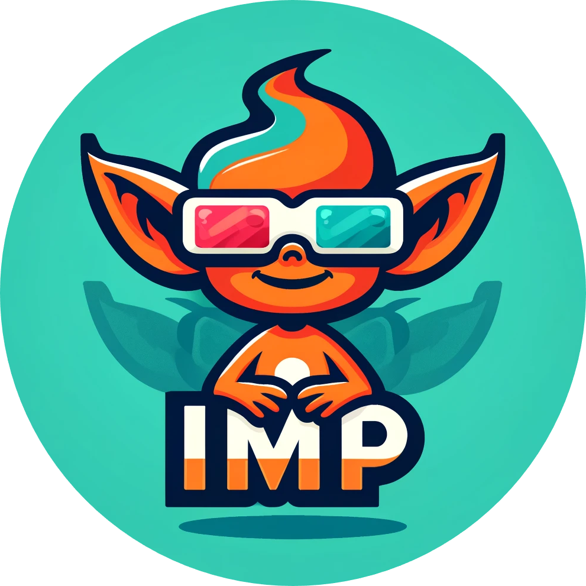
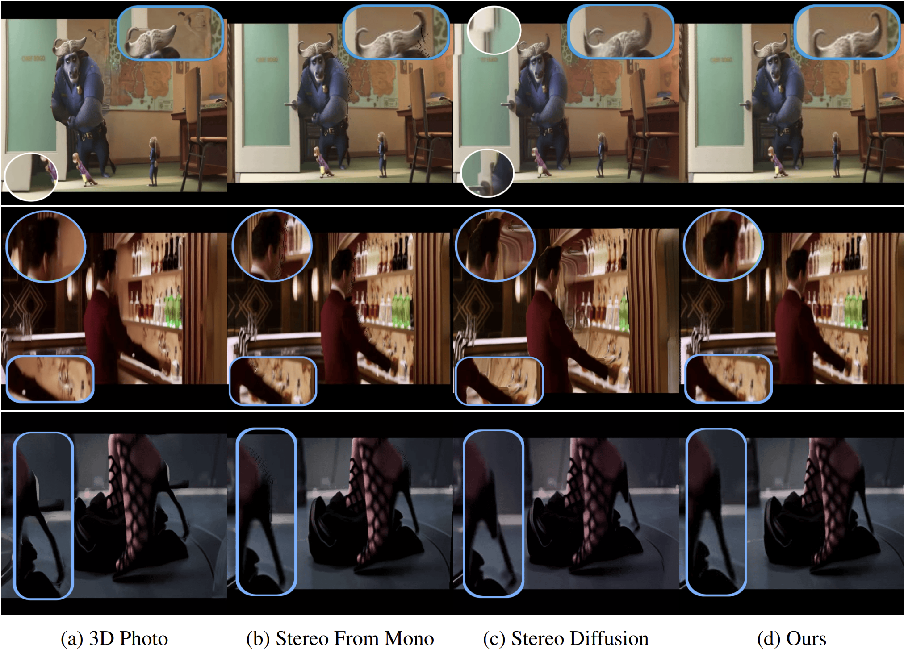

<div align="center">

<div class="logo">
   <a>
      
   </a>
</div>

<h1>ImmersePro: End-to-End Stereo Video Synthesis Via Implicit Disparity Learning</h1>

<div>
    <a href='#' target='_blank'>Jian Shi</a>&emsp;
    <a href='#' target='_blank'>ZhenYu Li</a>&emsp;
    <a href='#' target='_blank'>Peter Wonka</a>&emsp;
</div>
<div>
    KAUST&emsp; 
</div>


<div>
    <h4 align="center">
        <a href="https://shijianjian.github.io/ImmersePro" target='_blank'>
        
        </a>
        <a href="https://arxiv.org/abs/2410.00262" target='_blank'>
        
        </a>
        <a href="https://youtu.be/Lhu0hHsDvao" target='_blank'>
        
        </a>
    </h4>
</div>

⭐ If you like ImmersePro or if it is helpful to your projects, please help star this repo. Thanks! 🤗


</div>


<p align="center">
  
</p>

## Abstract

We introduce ImmersePro, an innovative framework specifically designed to transform single-view videos into stereo videos. This framework utilizes a novel dual-branch architecture comprising a disparity branch and a context branch on video data by leveraging spatial-temporal attention mechanisms. ImmersePro employs implicit disparity guidance, enabling the generation of stereo pairs from video sequences without the need for explicit disparity maps, thus reducing potential errors associated with disparity estimation models. In addition to the technical advancements, we introduce the YouTube-SBS dataset, a comprehensive collection of 423 stereo videos sourced from YouTube. This dataset is unprecedented in its scale, featuring over 7 million stereo pairs, and is designed to facilitate training and benchmarking of stereo video generation models. Our experiments demonstrate the effectiveness of ImmersePro in producing high-quality stereo videos, offering significant improvements over existing methods. Compared to the best competitor stereo-from-mono we quantitatively improve the results by 11.76% (L1), 6.39% (SSIM), and 5.10% (PSNR).

## Running

1. Download the checkpoints from [here](https://huggingface.co/shijianjian/ImmersePro). Then construct the project folder as:
    ```
    ├── experiments_model
    │   └── immersepro_model_inference
    │       ├── dis_030000.pth
    │       ├── gen_030000.pth
    │       └── opt_030000.pth
    ├── inference_video.py
    ├── model
    ...
    ```
2. Run with provided videos with `python inference_video.py -c configs/inference.json`.


## Demo

If you have VR devices already, you may try out the converted videos on the following link:

[](https://www.youtube.com/watch?v=Lhu0hHsDvao)